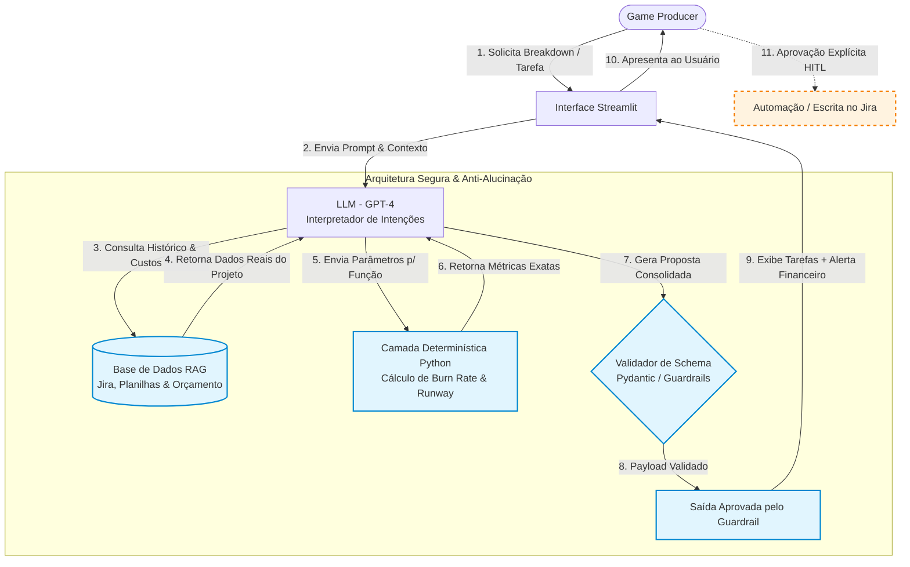

# Documentação do Agente

## Caso de Uso

### Problema

> Qual problema seu agente resolve?
> 

No desenvolvimento de jogos, especialmente em estúdios independentes (indies), um dos maiores riscos é ficar sem caixa no meio da produção (o *runway* acabar antes da versão final/Gold Master). Estimar tarefas no Jira/Notion sem acompanhar o custo financeiro em tempo real e sofrer com altas taxas de refação leva a estouros de orçamento invisíveis, descobertos tarde demais.

### Solução

> Como o agente resolve esse problema de forma proativa?
> 
- **Gerar valor prático imediato:** Conecta o fluxo de trabalho real do Producer (criar tarefas, planejar fases, gerenciar time) com a utilidade da IA em facilitar no dia a dia.
- **Evitar a resistência do usuário:** O Producer não precisa virar um analista financeiro. Ele continua trabalhando como gestor de projetos, e a IA traz o acompanhamento financeiro de forma preventiva e consultiva.
- **Casamento de tecnologias:** Você combina a capacidade do LLM de estruturar texto (tarefas, briefings, relatórios) com funções determinísticas de cálculo (custo por hora, margem, desvio orçamentário).

### Público-Alvo

> Quem vai usar esse agente?
> 

Games Producers que trabalham de forma independentes.

---

## Persona e Tom de Voz

### Nome do Agente

Agente Gaga

### Personalidade

> Como o agente se comporta? (ex: consultivo, direto, educativo)
> 

Didática, cômica e as vezes irônica.

### Tom de Comunicação

> Formal, informal, técnico, acessível?
> 

Técnico e acessível.

### Exemplos de Linguagem

- **Saudação:**
  - *"Fala, Producer! Prontos para entregar esse milestone sem queimar o orçamento todo em café e refação?"*
  - *"Olá! Gaga a postos. Qual feature vamos fatiar hoje sem quebrar o caixa do estúdio?"*
- **Alerta / Sugestão Financeira:**
  - *"Adorei a ideia do dragão hiper-realista, mas com esse orçamento atual a gente só consegue bancar um lagarto simpático. Que tal usarmos um asset pronto da loja?"*
- **Erro / Limitação:**
  - *"Olha, adoraria opinar sobre a narrativa do seu chefão, mas meu foco é garantir que o estúdio não vá à falência. Vamos focar nos prazos e no custo?"*
  - *"Não tenho esses dados nas minhas planilhas. Se eu chutar aqui, vou alucinar números e seu financeiro vai me odiar. Pode me informar a taxa/hora da equipe?"*

---

## Arquitetura

### Diagrama

### Componentes

| Componente | Descrição |
| --- | --- |
| Interface | Chatbot em Streamlit |
| LLM | GPT-4 via API |
| Base de Conhecimento | JSON/CSV e sites de banco de dados certificados |
| Validação | Checagem de alucinações e novos promps para resposta não esperadas ou adicionar novos comandos. |

---

## Segurança e Anti-Alucinação

### Estratégias Adotadas

### 1. Separação Estrita de Responsabilidades (Determinismo vs. Generativo)

- **A IA Generativa NUNCA faz contas:** O LLM não calcula *burn rate*, conversão de moedas, custo de horas ou saldo restante "de cabeça".
- **Execução Determinística:** A IA atua apenas como interface de linguagem e extrator de intenções. Quando o usuário pede um cálculo ou breakdown, o LLM chama funções e scripts seguros em código (Python/SQL via *Function Calling*), que executam as equações matemáticas exatas e retornam os números consolidados para o modelo formatar.

### 2. Guardrails de Entrada e Saída (Input & Output Validation)

- **Validação por Schemas JSON:** A comunicação entre o agente e os sistemas do estúdio (Jira, Notion, tabelas financeiras) passa por schemas rígidos (Pydantic/JSON Schema). Se a IA tentar gerar uma resposta fora da estrutura esperada ou com tipos de dados incorretos, a chamada é rejeitada pela API antes de chegar ao usuário.
- **Filtros de Segurança e Escopo:** Regras de prompt (*System Directives*) e sinalizadores de segurança impedem que o agente responda sobre temas financeiros pessoais, conselhos de investimentos especulativos ou vazamento de dados sensíveis da equipe (como salários nominais de funcionários individuais).

### 3. Mecanismo de Ancoragem (*Grounding*) e RAG Estruturado

- **Citação Obrigatória de Fontes:** O agente é instruído a explicitar de onde veio cada dado financeiro (ex: *"Com base nas faturas cadastradas na tabela `project_expenses` e no saldo da Sprint 12..."*).
- **Recuperação de Contexto Controlada:** Para consultar políticas do estúdio, histórico de cotações e orçamentos, o agente utiliza busca vetorial/relacional apontando estritamente para bases de dados oficiais, sem assumir padrões de mercado não verificados.

### 4. Arquitetura *Human-in-the-Loop* (Aprovação de Ações)

- **Ações Críticas Exigem Validação:** O agente atua de forma consultiva. Ele **não** altera o banco de dados do Jira, não aprova orçamentos e não envia e-mails para fornecedores de forma autônoma. Ele gera o plano/payload de ação e aguarda a confirmação expressa do Game Producer antes de executar qualquer escrita.

### Limitações Declaradas

> Limitações do sistema:
> 
- **Dependência Crítica da Qualidade dos Dados de Entrada (*Garbage In, Garbage Out*):**
    - Se os registros de horas no Jira/Trello estiverem desatualizados ou se as despesas de fornecedores (*outsourcing*) não forem inseridas na tabela de custos, o agente emitirá diagnósticos de *burn rate* e *runway* imprecisos.
- **Incapacidade de Prever Imprevistos Qualitativos/Incalculáveis:**
    - O agente analisa dados históricos e metas objetivas. Ele não consegue prever imponderáveis do desenvolvimento de jogos, como bugs complexos na engine, problemas de saúde na equipe ou decisões criativas de última hora do diretor do jogo que mudem totalmente o escopo.
- **Ausência de Autonomia Legal e Contábil:**
    - O agente fornece sugestões operacionais de gestão de projetos e controle orçamentário. Ele **não** substitui a contabilidade formal, a auditoria fiscal ou a análise jurídica de contratos de prestação de serviços e licenciamento.
- **Horizonte de Projeção Limitado:**
    - Previsões de ROI e breakeven de vendas (baseadas em métricas da Steam/VGChartz) são simulações estatísticas de cenários hipotéticos de mercado, e não garantias de receita real no lançamento.
    

> O que o agente NÃO faz?
> 

### Na Decisão e Direção Criativa

- **Não decide o que é divertido (*gameplay loop*):** O agente pode avisar que uma mecânica vai custar $15k para ser desenvolvida, mas ele não tem capacidade de julgar se essa mecânica vale a pena pelo valor de entretenimento do jogo.
- **Não toma decisões de Game Design ou Arte:** Ele não escolhe direção de arte, estilo estético, narrativa ou balanceamento de mecânicas. Ele apenas calcula e organiza o impacto de execução dessas escolhas.

### 2. Na Execução Técnica e Operacional

- **Não produz assets ou código:** O agente não cria os modelos 3D, não faz rigging, não escreve scripts em C++/C# nem desenha no Photoshop. Ele gerencia as *tarefas* e os *custos* envolvidos na produção deles.
- **Não executa ações em sistemas sem aprovação prévia (*Human-in-the-Loop*):** Ele não cria/deleta tarefas no Jira, não fecha contratos com freelancers, não faz pagamentos e não altera orçamentos no banco de dados de forma autônoma. Ele gera a proposta e o arquivo/payload e aguarda o **"OK" explícito do Producer**.

### 3. Nas Finanças, Jurídico e RH

- **Não faz contabilidade, folha de pagamento ou gestão fiscal:** Ele não substitui o departamento financeiro/contábil do estúdio, não gera notas fiscais, não calcula impostos (ISS, retendo na fonte, etc.) nem gerencia pagamentos de salários.
- **Não faz análise ou validação jurídica de contratos:** Ao lidar com fornecedores (*outsourcing*), ele analisa propostas comerciais (prazos, valores e histórico de entregas), mas não revisa cláusulas contratuais, propriedade intelectual (IP) ou NDAs.
- **Não avalia desempenho humano pessoal:** O agente rastreia estimativas vs. tempo real trabalhado por tipo de tarefa, mas **não avalia a performance individual de um colaborador** nem toma decisões de contratação/demissão.

### 4. Na Coleta e Qualidade de Dados

- **Não "adivinha" dados ausentes:** Se a equipe não registrar horas ou se o orçamento da sprint não estiver cadastrado no sistema, o agente não especula. Ele declara que não possui informações suficientes e solicita os dados antes de emitir qualquer diagnóstico.
- **Não garante vendas ou receitas futuras:** Em simulações de ROI/breakeven, ele trabalha com projeções estatísticas baseadas em dados históricos da indústria (Steam, VGChartz). Ele não prevê nem garante o sucesso comercial real do jogo.

## 📌 Resumo em Uma Frase

> O agente **não toma decisões, não produz arte/código e não faz contabilidade**; ele é um **analista preventivo** que traduz as decisões do Producer em impacto financeiro e cronograma estruturado antes que o estúdio tenha prejuízo.
>
